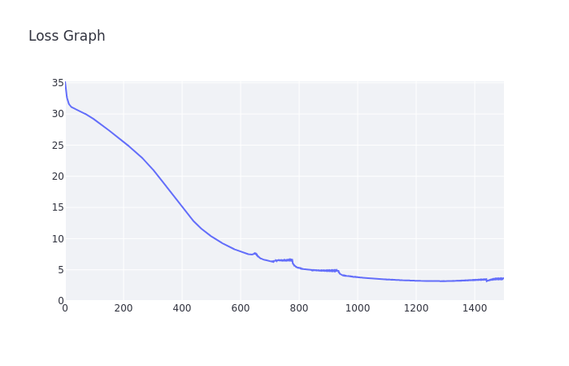

[](https://classroom.github.com/a/YFgwt0yY)
# MiniTorch Module 2


* Docs: https://minitorch.github.io/

* Overview: https://minitorch.github.io/module2/module2/

This assignment requires the following files from the previous assignments. You can get these by running

```bash
python sync_previous_module.py previous-module-dir current-module-dir
```

The files that will be synced are:

        minitorch/operators.py minitorch/module.py minitorch/autodiff.py minitorch/scalar.py minitorch/scalar_functions.py minitorch/module.py project/run_manual.py project/run_scalar.py project/datasets.py

## Task 2.5

### Simple Dataset

Number Hidden Layers: 2

Epoch Size: 500

Learning Rate: 0.05

Time per Epoch: 0.030s

Total Time: 15 seconds


| Epoch | Loss  | Correct |
|-------|-------|---------|
| 500   | 3.8833| 50      |
| 490   | 4.0292| 50      |
| 480   | 4.1844| 50      |
| 470   | 4.3500| 50      |
| 460   | 4.5267| 50      |
| 450   | 4.7155| 50      |
| 440   | 4.9180| 50      |
| 430   | 5.1351| 50      |
| 420   | 5.3682| 50      |
| 410   | 5.6198| 50      |
| 400   | 5.8915| 50      |
| 390   | 6.1850| 50      |
| 380   | 6.5025| 50      |
| 370   | 6.8486| 50      |
| 360   | 7.2240| 50      |
| 350   | 7.6305| 50      |
| 340   | 8.0709| 50      |
| 330   | 8.5484| 50      |
| 320   | 9.0686| 50      |
| 310   | 9.6379| 50      |
| 300   | 10.2582| 50     |
| 290   | 10.9289| 50     |
| 280   | 11.6569| 50     |
| 270   | 12.4435| 50     |
| 260   | 13.2883| 50     |
| 250   | 14.1908| 50     |
| 240   | 15.1679| 50     |
| 230   | 16.1979| 50     |
| 220   | 17.2700| 50     |
| 210   | 18.3827| 50     |
| 200   | 19.4977| 50     |
| 190   | 20.6199| 50     |
| 180   | 21.7477| 50     |
| 170   | 22.8506| 50     |
| 160   | 23.9649| 50     |
| 150   | 25.0355| 50     |
| 140   | 26.0346| 50     |
| 130   | 26.9921| 50     |
| 120   | 27.8757| 47     |
| 110   | 28.7084| 47     |
| 100   | 29.4915| 46     |
| 90    | 30.2167| 45     |
| 80    | 30.9269| 43     |
| 70    | 31.5515| 43     |
| 60    | 32.0990| 39     |
| 50    | 32.5887| 36     |
| 40    | 33.0377| 34     |
| 30    | 33.4664| 30     |
| 20    | 33.9031| 28     |
| 10    | 34.3933| 26     |


### Diagonal Dataset

Number Hidden Layers: 4

Epoch Size: 500

Learning Rate: 0.5

Time per Epoch: 0.061s

Total Time: 30.50 seconds


| Epoch | Loss    | Correct |
|-------|---------|---------|
| 500   | 1.7690  | 50      |
| 490   | 1.7737  | 50      |
| 480   | 1.8317  | 49      |
| 470   | 1.9719  | 49      |
| 460   | 1.9970  | 49      |
| 450   | 2.1838  | 48      |
| 440   | 2.5847  | 48      |
| 430   | 2.4408  | 48      |
| 420   | 1.6624  | 50      |
| 410   | 1.5315  | 50      |
| 400   | 1.5355  | 50      |
| 390   | 1.5697  | 50      |
| 380   | 1.6045  | 50      |
| 370   | 1.6410  | 50      |
| 360   | 1.6793  | 50      |
| 350   | 1.7201  | 50      |
| 340   | 1.7665  | 50      |
| 330   | 1.8103  | 50      |
| 320   | 1.8599  | 50      |
| 310   | 1.9093  | 50      |
| 300   | 1.9651  | 50      |
| 290   | 2.0270  | 50      |
| 280   | 2.0952  | 50      |
| 270   | 2.1668  | 50      |
| 260   | 2.2425  | 50      |
| 250   | 2.3220  | 50      |
| 240   | 2.4069  | 49      |
| 230   | 2.4992  | 50      |
| 220   | 2.5993  | 50      |
| 210   | 2.7095  | 50      |
| 200   | 2.8321  | 50      |
| 190   | 2.9778  | 49      |
| 180   | 3.1266  | 49      |
| 170   | 3.2808  | 50      |
| 160   | 3.4764  | 49      |
| 150   | 3.6778  | 50      |
| 140   | 3.9083  | 50      |
| 130   | 4.1708  | 50      |
| 120   | 4.4592  | 50      |
| 110   | 4.8031  | 50      |
| 100   | 5.1904  | 49      |
| 90    | 5.6431  | 48      |
| 80    | 6.1938  | 48      |
| 70    | 6.9636  | 48      |
| 60    | 8.0916  | 46      |
| 50    | 9.7097  | 44      |
| 40    | 12.3850 | 43      |
| 30    | 15.1540 | 43      |
| 20    | 17.2128 | 43      |
| 10    | 18.7627 | 43      |


### Split Dataset
Number Hidden Layers: 5

Epoch Size: 1500

Learning Rate: 0.1

Time per Epoch: 0.130s

Total Time: 195 seconds


| Epoch | Loss    | Correct |
|-------|---------|---------|
| 1500  | 3.0271  | 50      |
| 1490  | 3.0512  | 50      |
| 1480  | 3.0756  | 50      |
| 1470  | 3.1005  | 50      |
| 1460  | 3.1257  | 50      |
| 1450  | 3.1514  | 50      |
| 1440  | 3.1776  | 50      |
| 1430  | 3.2042  | 50      |
| 1420  | 3.2313  | 50      |
| 1410  | 3.2588  | 50      |
| 1400  | 3.2869  | 50      |
| 1390  | 3.3155  | 50      |
| 1380  | 3.3446  | 50      |
| 1370  | 3.3743  | 50      |
| 1360  | 3.4046  | 50      |
| 1350  | 3.4355  | 50      |
| 1340  | 3.4670  | 50      |
| 1330  | 3.4991  | 50      |
| 1320  | 3.5319  | 50      |
| 1310  | 3.5654  | 50      |
| 1300  | 3.5996  | 50      |
| 1290  | 3.6345  | 50      |
| 1280  | 3.6702  | 50      |
| 1270  | 3.7068  | 50      |
| 1260  | 3.7441  | 50      |
| 1250  | 3.7824  | 50      |
| 1240  | 3.8215  | 50      |
| 1230  | 3.8616  | 50      |
| 1220  | 3.9027  | 50      |
| 1210  | 3.9448  | 50      |
| 1200  | 3.9880  | 50      |
| 1190  | 4.0324  | 50      |
| 1180  | 4.0779  | 50      |
| 1170  | 4.1247  | 50      |
| 1160  | 4.1728  | 50      |
| 1150  | 4.2223  | 49      |
| 1140  | 4.2732  | 49      |
| 1130  | 4.3257  | 49      |
| 1120  | 4.3798  | 49      |
| 1110  | 4.4355  | 49      |
| 1100  | 4.4931  | 49      |
| 1090  | 4.5526  | 49      |
| 1080  | 4.6140  | 49      |
| 1070  | 4.6777  | 49      |
| 1060  | 4.7436  | 49      |
| 1050  | 4.8119  | 49      |
| 1040  | 4.8828  | 49      |
| 1030  | 4.9564  | 49      |
| 1020  | 5.0331  | 49      |
| 1010  | 5.1129  | 49      |
| 1000  | 5.1962  | 49      |
| 990   | 5.2830  | 49      |
| 980   | 5.3739  | 49      |
| 970   | 5.4689  | 49      |
| 960   | 5.5686  | 49      |
| 950   | 5.6731  | 49      |
| 940   | 5.7831  | 49      |
| 930   | 5.8988  | 49      |
| 920   | 6.0208  | 49      |
| 910   | 6.1497  | 49      |
| 900   | 6.2861  | 49      |
| 890   | 6.4312  | 49      |
| 880   | 6.5854  | 49      |
| 870   | 6.7504  | 49      |
| 860   | 6.9271  | 49      |
| 850   | 7.1167  | 49      |
| 840   | 7.3308  | 49      |
| 830   | 7.5718  | 49      |
| 820   | 7.8375  | 49      |
| 810   | 8.1324  | 49      |
| 800   | 8.6134  | 48      |
| 790   | 9.1117  | 48      |
| 780   | 9.5381  | 48      |
| 770   | 10.0010 | 48      |
| 760   | 10.4613 | 48      |
| 750   | 10.7974 | 48      |
| 740   | 11.1655 | 48      |
| 730   | 11.5554 | 48      |
| 720   | 11.9568 | 48      |
| 710   | 12.3650 | 48      |
| 700   | 12.8117 | 48      |
| 690   | 13.2759 | 48      |
| 680   | 13.7382 | 48      |
| 670   | 14.2044 | 48      |
| 660   | 14.6761 | 48      |
| 650   | 15.1619 | 47      |
| 640   | 15.6554 | 47      |
| 630   | 16.1438 | 46      |
| 620   | 16.6317 | 45      |
| 610   | 17.1202 | 45      |
| 600   | 17.6163 | 44      |
| 590   | 18.1095 | 43      |
| 580   | 18.5933 | 43      |
| 570   | 19.0637 | 43      |
| 560   | 19.5193 | 43      |
| 550   | 19.9571 | 44      |
| 540   | 20.3793 | 44      |
| 530   | 20.7858 | 44      |
| 520   | 21.1788 | 44      |
| 510   | 21.5602 | 44      |
| 500   | 21.9285 | 42      |
| 490   | 22.2813 | 42      |
| 480   | 22.6194 | 41      |
| 470   | 22.9430 | 39      |
| 460   | 23.2536 | 39      |
| 450   | 23.5520 | 39      |
| 440   | 23.8398 | 39      |
| 430   | 24.1159 | 39      |
| 420   | 24.3804 | 38      |
| 410   | 24.6338 | 38      |
| 400   | 24.8761 | 38      |
| 390   | 25.1087 | 38      |
| 380   | 25.3319 | 38      |
| 370   | 25.5463 | 38      |
| 360   | 25.7524 | 38      |
| 350   | 25.9501 | 38      |
| 340   | 26.1420 | 38      |
| 330   | 26.3325 | 38      |
| 320   | 26.5249 | 38      |
| 310   | 26.7210 | 38      |
| 300   | 26.9201 | 38      |
| 290   | 27.1163 | 38      |
| 280   | 27.3174 | 38      |
| 270   | 27.5264 | 38      |
| 260   | 27.7471 | 38      |
| 250   | 27.9665 | 38      |
| 240   | 28.1846 | 38      |
| 230   | 28.4142 | 38      |
| 220   | 28.6691 | 38      |
| 210   | 28.9335 | 37      |
| 200   | 29.1898 | 37      |
| 190   | 29.4376 | 37      |
| 180   | 29.6778 | 36      |
| 170   | 29.9143 | 37      |
| 160   | 30.1491 | 36      |
| 150   | 30.3810 | 36      |
| 140   | 30.6024 | 36      |
| 130   | 30.8166 | 36      |
| 120   | 31.0301 | 36      |
| 110   | 31.2541 | 36      |
| 100   | 31.4876 | 36      |
| 90    | 31.7112 | 36      |
| 80    | 31.9292 | 36      |
| 70    | 32.1504 | 36      |
| 60    | 32.3674 | 36      |
| 50    | 32.5727 | 36      |
| 40    | 32.7738 | 36      |
| 30    | 32.9649 | 35      |
| 20    | 33.1741 | 35      |
| 10    | 33.3646 | 35      |


### XOR Dataset
Number Hidden Layers: 4

Epoch Size: 2500

Learning Rate: 0.05

Time per Epoch:

Total Time:




